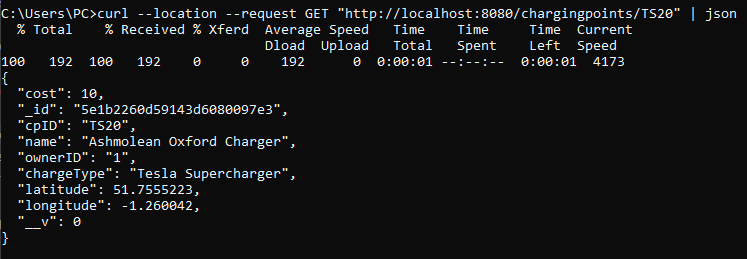

# SOA Assignment - 2019 - Kamal Mahmassani

*An online version of this document can be found at https://github.com/kmahmassani/SOA-Assignment/blob/master/Assignment.md*

<div style="text-align: justify">

## Part A

### 1)


*for eligibility, the communication of all the services with the Identity micro-service has been omitted*

### 2)

#### A brief flow of the system

First a charging point owner, using the REST Api or portal, registers with the system and fills out their profile, via the identity and user services.  He then creates records for his charging points in the Charging Point Info service.  Upon saving, the Charging Point Info service fires off an event message to the event bus which includes PointID, Location and MAC Address.  These event messages are subscribed to by the Location, Reservation and Point Status services.  The Location service now knows there is a point at those certain coordinates, the reservation service knows a new point is available for use, and the point status service now expects a device with that MAC address to connect to it.

The charging point itself connects to the point status service and provides live updates to it's status (Available/In-use/Maintenance mode) and possibly some identifying info as to which car is currently charging (could be useful for payment info).

After drivers are authenticated, their cars/phones query the location service with either a GPS point and a radius, or a route which they will travel.  They will get back a set of point ids which they can then query the Charging Point service (CPS) using GraphQL to get the subset of points which are compatible with their car and their live status which was retrieved by the CPS from the point status service.  After identifying one and making sure their are no prior reservations, they can either drive straight to it, or choose to reserve it themselves.

Once drivers arrive to the charging point and plug-in, their car would contact the reservation service and provide an estimation of how long they would take to be ready to move on. The charging point itself changes its status to in-use and back to available when the car unplugs.

#### Justification


The system has been designed with a micro-services approach with the aim of striking a balance between the size and number of services.  

This allows the following benefits:

* **Easier to build and maintain**

  The system becomes easier to build and maintain as it is split into smaller micro-services.  Each micro-service is an independent, so a services can be coded in a different language and use different databases without any affect on the other services.  The individual services can also be deployed, swapped out and/or managed independently of the other services, each one can be allocated resources suited to it's requirements.  If one service fails, it should not affect the rest of the system, and should be easily replaced/restarted.

* **Improved Productivity**

  This design approach allows the system to be broken up into more manageable subsystems, which can each be the responsibility of different teams, leading to expert teams in their respective areas.  Each team can work independently without relying on other teams to finish their work.  Each service can be tested and deployed independently, improving quality assurance and reducing time taken for something to reach production.

* **Flexibility and Scalability**

  Because each service can use it's own tech stack, it can choose the best one for it's specific needs, and due to the fact that each service is decoupled from the rest, new services can be added to the system or existing ones scaled with relative ease.  This also allows experimentation, as a micro-service written in one language can easily be replaced by another rewritten in a different language as compared to rewriting a whole monolithic application.

There is a price to pay however, that must be managed:

* **Cost of entry**

  Because the micro-services become a distributed system, the code inherit some complexities.  Remote calls are slower than in-process ones, and have to be managed using asynchronous for example.  Remote calls can also fail at any time, so you have to design for failure.  Generally speaking, your developers have to have reached a certain level of skill and maturity before they should attempt to build a micro-services system.

<figure class="image">
  
  <figcaption>The Microservices Premium <cite>- Martin Fowler</cite></figcaption>
</figure>

*  **Eventual Consistency**

   >"Micro-services introduce eventual consistency issues because of their laudable insistence on decentralized data management. With a monolith, you can update a bunch of things together in a single transaction. Micro-services require multiple resources to update, and distributed transactions are frowned on (for good reason). So now, developers need to be aware of consistency issues, and figure out how to detect when things are out of sync before doing anything the code will regret."
   >
   > <cite>-- Martin Fowler</cite>

### 3)

* **HTTP(s) + REST**

  The combination of HTTP and REST was chosen for the majority of communications because HTTP is the widely accepted and de-facto standard of communication on the internet.  It's use along with the REST design pattern and JSON serialization, provides a method that is easy to implement, takes advantage of the standard HTTP verbs, widely known, scalable and also platform independent.  Several tools to generate human and machine readable documentation for REST APIs are available, such as OpenAPI.

* **gRPC**

   While REST is primarily based on HTTP/1, gRPC is a protocol built on top of HTTP/2.  gRPC was chosen for:

  * Charging Points to connect to their status service due to the fact that it is more efficient than normal HTTP and REST, in it's use of protobuf for serialization and contract based communication (which is less resource demanding and therefore can be used in low power IoT devices).  It also allows the charging points to take advantage of HTTP/2 and stream their current status to the service on the same consistent connection, unlike REST which would require a new connection to be negotiated everytime an update is to be sent.
  
  * For the charging point info and reservation services to read data from the status service.  Because this is internal communication, we do not need to cater to such a wide consumer base as the other REST based services.  We can use gRPC and reap it's performance and efficiency rewards.

* **GraphQL**

   The option of GraphQL was provided on the Charging Point Info service for cars and mobile apps where network bandwidth and latency might be of concern.  It provides those clients with the ability to query data and retrieve only the data and fields that they require.

### 4)

Service&nbsp;&nbsp;&nbsp;&nbsp;&nbsp;&nbsp;&nbsp;&nbsp;&nbsp;&nbsp;&nbsp;&nbsp;&nbsp;&nbsp;&nbsp; | Description
:--- | ---
Identity Service | This service deals with authentication and authorization for the whole system.  It can deal with external services to handle MFA, and provides access tokens to required across the rest of the services.  This was implemented in its own service as it acts as a gate keeper for the rest of the system.
User Service | This service encapsulates all info regarding to users, whether they be charging point owners or drivers, and via a web portal, mobile app, or car/program connecting directly to the REST api.  It contains profile information about each user, such as name, address, contact info.  In some cases, such as cars it might include, more detail such as color/model/registration of the car, due to this non-uniformity in data, and the fact that the data is largely non-relational,  it's data is stored in a NoSQL Document DB, such as CosmosDB or MongoDB.
Charging Point Info Service | Contains info regarding each charging point, such as who owns it, compatible charging types and power ratings, along with cost of use and charging speed and location.  Provides a GraphQL option to allow cars and mobile app consumers to specify exactly what data they need.
Location Service | This service is purely dedicated to the relatively CPU intensive operation of querying GPS coordinates.  It handles finding nearby charging points relative to a single GPS point, and also along a route, provided by a set of points.  It's database is GIS specific such as Postgres with the PostGIS plugin, and only contains Charging Point IDs along with their locations.
Reservation Service | This service handles reservations and scheduled maintenance/downtimes, allowing drivers and cars to reserve points in advance, and also for currently charging cars to give estimates of when they will move on and vacate the charge point.
Point Status Service | This service allows the charging points themselves to connect to the system and provide a heart-beat/status via gRPC streaming.  It can also provide the real time actual status of the point, regardless of any scheduled reservations or downtimes.

### 5)


## Part B

*I have assumed that only it is only required to implement one of the micro-services that the car can communicate with, and have chosen the Charging Point Info Service.*

### 1)

A machine readable OpenApi JSON file is in the appendix


### 2)

```javascript
const express = require('express')
const router = express.Router()
const { ChargingPoints } = require('../models/chargingPoint')


//Get All
router.get('/', async (req, res) => {
    try {
        const cp = await ChargingPoints.find()
        res.json(cp)
      } catch (err) {
        res.status(500).json({ message: err.message })
      }
})

// Get by ID
router.get('/:id', async (req, res) => {
    const id = req.params.id

    if (!id || id == '')
    {
        res.status(400).statusMessage('Invalid ID supplied')
        return;
    }

    try {
        const cp = await ChargingPoints.findOne({ cpID: id})

        if (!cp)
        {
            res.status(404).statusMessage('Point not found')
            return;
        }
        res.json(cp)
      } catch (err) {
        res.status(500).json({ message: err.message })
      }
})

module.exports = router
```

```javascript
const resolvers = {
    points: (args, context) => context().then(db => db.collection('chargingpoints').find(),
    point: (args, context) =>  context().then(db => db.collection('chargingpoints').findOne({ cpID: args.cpId}).toArray())
  };

app.use('/graphql', graphqlHTTP({
    schema:ChargingPointQL,
    rootValue: resolvers,
    context,
    graphiql: true
  }))
```

### 3)





## Part C

### 1)


### 2)

Identity&nbsp;&nbsp;&nbsp;| Description
---|---
CP Owner| The owners of the charging points.  Each owner should be able to manage their own charging points and not be able to access those not owned by them.
Driver| The drivers of cars that have access the system through the mobile app.  They should be able to manage their reservations and only query CPs and their locations.
Car| Similar to the driver identity, except that these might come preconfigured from the factory with the necessary access to the system.
CP| The physical charging points that connect to the system.  Should only provide data about their current status, and not query any data.

The identities will be managed via XACML3.0 policy based access control.  Each identity type will be added to the identity server along with the rules which govern what they are permitted to see and do.  XACML allows attributes associated with the user to be used as input into the decision of whether a given user may access a given resource.  Offloading this decision to the Identity Server and API gateway, entails separation of enforcement from decision making from definition of the authorization.  This allows the central modification of the policies, and to view and audit them easily.  It also allows the developers to focus on the API's purpose itself, without having to worry about writing code specifically for auth.

The API gateway plays an integral part in this process, it makes sure all traffic is properly authenticated and authorized before directing traffic to the underlying services.


In the above diagram, first the client authenticates with the identity server using OAuth2.  Upon authentication, the identity server then provides the client with an access token which he then includes with all requests to other services.  The requests are intercepted by the API manager, which then sends the token back to the identity service.  The token is verified and access control is queried via the XACML store.  A JSON Web Token is returned to the API Gateway which then embeds it with the requests to the destination service.  In this way, we achieve separation of concerns, with the API Manager/Gateway handling enforcement, the Identity Service handling decision making and the only burden which the micro-services handle is the verification of the JWT.

For the cars and physical charging points, OAuth may not be possible or practical for authentication.  We can make use of X.509 certificates.  When a CPO configures a new charging point, they will be able to download a certificate file which they would then place on the IoT device. When the device connects to the system, the Identity Server will verify the devices certificate against it's own root certificate and provide authentication accordingly.  Car manufacturers may use the same method and embed certificates in the cars, in-order to avoid requiring the driver to sign in each time he turns on the car.  This would require a certificate server to hold the root certificates, issue new client certificates and to handle verification.

### 3)

To ensure genuine data is entered into the system, we could first verify all CP owners with Multi Factor Authentication.  We might also only list Charging Points on the system after they have successfully connected to the status service and start transmitting.  A possible addition to the system might be the inclusion of a rating system, whereby drivers could rate or report a charging point.  After a certain number of bad reviews, a charging point might be marked as inaccurate and removed from the system.
As mentioned in question 2, we can enforce access control on drivers, via OAuth + MFA, and cars via X.509 certificates.  This allows us to restrict them to only querying location and info data, and only be able to create or edit their own reservations.  As mentioned above this is managed by the identity and certificate servers.

### 4)

The system will implement a CI/CD pipline as shown below.


Developers push code to the code repository which is monitored by CI pipeline such as Jenkins.  Jenkins pulls the code, builds the docker image and runs automated tests.  If the build passes testing, then the docker image is pushed to the container registry.  A program such as Spinnaker, or Jenkins itself, would then deploy the new images to a Dev environment where more intensive testing may be run.  Once testing is complete, the build is moved to the staging environment where it undergoes further testing, and maybe demoing to stakeholders, before finally being released to production.  If this pipeline is correctly set up and implemented, it is possible to deploy quality assured code to production in a less as a few minutes.

The system will be monitored by a combination of the built in features of the API Gateway logging traffic, Kafka recording all events sent on the messaging bus and software such as prometheus, which monitors Kubernetes health, providing proactive monitoring, cluster visibility, alerts and metrics dashboards.

## D)

This approach allows us to build a system that can be built by several teams in parallel, be quickly tested and deployed to production multiple times per day and scale automatically according to traffic.  It allows teams to become experts in their respective domain concerns.  Future additions would be added as new services, such as payments integrations and charging point reviews.  This would be done with ease due to the decoupled nature of the micro-services architecture.  It is highly resilient to failures, containers can be killed and replaced on the fly, services replaced seamlessly, A/B testing can be performed through API gateway routing, and even the whole system can be cloned across cloud providers, invisibly to the end users.
SOA affected my approach and made me think about splitting the system down into several domains, and treating each domain as a product.  The products translated to services, which were implemented as "cattle", easy to replace, and stateless.

</div>


## Appendix

### Swagger OpenApi JSON Spec

```json

{
  "swagger": "2.0",
  "info": {
    "description": "This is the Charging Points Info Service",
    "version": "1.0.0",
    "title": "EV Network Charging Points Info Service",
    "termsOfService": "http://swagger.io/terms/",
    "contact": {
      "email": "kmahmassani@gmail.com"
    },
    "license": {
      "name": "Apache 2.0",
      "url": "http://www.apache.org/licenses/LICENSE-2.0.html"
    }
  },
  "tags": [
    {
      "name": "chargingpoints",
      "description": "Information about available charging points"
    },
    {
      "name": "graphql",
      "description": "Access to GraphQL for querying"
    }
  ],
  "schemes": [
    "https",
    "http"
  ],
  "paths": {
    "/chargingpoints": {
      "get": {
        "tags": [
          "chargingpoints"
        ],
        "parameters": [
          {
            "name": "api_key",
            "in": "header",
            "required": true,
            "type": "string"
          }
        ],
        "summary": "get all charging points",
        "description": "",
        "operationId": "addPet",
        "produces": [
          "application/json"
        ],
        "responses": {
          "200": {
            "description": "successful operation",
            "schema": {
              "type": "array",
              "items": {
                "$ref": "#/definitions/point"
              }
            }
          }
        }
      }
    },
    "/chargingpoints/{cpId}": {
      "get": {
        "tags": [
          "chargingpoints"
        ],
        "summary": "Find charging point by ID",
        "description": "Returns a single charging point",
        "produces": [
          "application/json"
        ],
        "parameters": [
          {
            "name": "api_key",
            "in": "header",
            "required": true,
            "type": "string"
          },
          {
            "name": "cpId",
            "in": "path",
            "description": "ID of charging point to return",
            "required": true,
            "type": "string"
          }
        ],
        "responses": {
          "200": {
            "description": "successful operation",
            "schema": {
              "$ref": "#/definitions/point"
            }
          },
          "400": {
            "description": "Invalid ID supplied"
          },
          "404": {
            "description": "Point not found"
          }
        }
      }
    },
    "/graphql": {
      "get": {
        "tags": [
          "graphql"
        ],
        "description": "This is the GraphQL endpoint",
        "responses": {
          "200": {
            "description": "results",
            "schema": {
              "type": "array",
              "items": {
                "$ref": "#/definitions/point"
              }
            }
          }
        }
      }
    }
  },
  "definitions": {
    "point": {
      "type": "object",
      "properties": {
        "cpId": {
          "type": "string",
          "example": "TS512"
        },
        "name": {
          "type": "string",
          "example": "Tesco's Supermarket Charger"
        },
        "ownerID": {
          "type": "string",
          "example": "SB401"
        },
        "cost": {
          "type": "number",
          "format": "float",
          "example": 5.2
        },
        "latitude": {
          "type": "number",
          "format": "float",
          "example": 51.7555223
        },
        "longitude": {
          "type": "number",
          "format": "float",
          "example": -1.260042
        },
        "chargeType": {
          "type": "string",
          "description": "Order Status",
          "enum": [
            "Tesla Supercharger",
            "Caravan Mains Socket",
            "Europlug"
          ]
        }
      }
    }
  },
  "externalDocs": {
    "description": "Find out more about Swagger",
    "url": "http://swagger.io"
  }
}

````

### CP Info Service Code

#### Charging Point Model

````javascript

const mongoose = require('mongoose')
const { buildSchema } = require('graphql');

const chargingPointSchema = new mongoose.Schema({
    cpID: {
      type: String,
      required: true,
      unique: true
    },
   name : {
       type: String,
       required: true
   },
   ownerID: {
    type: String,
    required: true
   },
   cost: {
    type: Number,
    default: 0   
   },
   latitude: Number,
   longitude: Number,
   chargeType: {
       type: String,
       enum: ['Tesla Supercharger','Caravan Mains Socket', 'Europlug'],
       required: true
   }
  })

const ChargingPoints = mongoose.model('ChargingPoint', chargingPointSchema);


const ChargingPointQL = buildSchema(`
    type Query {
        points: [ChargingPoint]
        point(cpId: String): ChargingPoint
    }
    type ChargingPoint {
        cpID: String,
        name: String,
        ownerID: String,
        cost: Float,
        latitude: Float,
        longitude: Float,
        chargeType: String
    }
`)

module.exports = { ChargingPoints, ChargingPointQL };
  
````

#### Charging Point Route

````javascript
const express = require('express')
const router = express.Router()
const { ChargingPoints } = require('../models/chargingPoint')


//Get All
router.get('/', async (req, res) => {
    try {
        const cp = await ChargingPoints.find()
        res.json(cp)
      } catch (err) {
        res.status(500).json({ message: err.message })
      }
})

// Get by ID
router.get('/:id', async (req, res) => {
    const id = req.params.id

    if (!id || id == '')
    {
        res.status(400).statusMessage('Invalid ID supplied')
        return;
    }

    try {
        const cp = await ChargingPoints.findOne({ cpID: id})

        if (!cp)
        {
            res.status(404).statusMessage('Point not found')
            return;
        }
        res.json(cp)
      } catch (err) {
        res.status(500).json({ message: err.message })
      }
})

module.exports = router

````

#### Server

````javascript

require('dotenv').config()
const express = require('express')
const app = express()
const mongoose = require('mongoose')
const { MongoClient } = require('mongodb');
const graphqlHTTP = require('express-graphql');
const { ChargingPointQL } = require('./models/chargingPoint');

mongoose.connect(process.env.DATABASE_URL, { useNewUrlParser: true })
const dbContext = mongoose.connection
dbContext.on('error', (error) => console.error(error))
dbContext.once('open', () => console.log('connected to database'))

app.use(express.json())

// GRAPHQL END POINT
const chargingpointsRouter = require('./routes/chargingpoints')

app.use('/chargingpoints', chargingpointsRouter) 

const context = () => MongoClient.connect(process.env.DATABASE_URL, { useNewUrlParser: true }).then(client => client.db('chargingpointsdb'));

const resolvers = {
    points: (args, context) => context().then(db => db.collection('chargingpoints').find().toArray()),   
    point: (args, context) =>  context().then(db => db.collection('chargingpoints').findOne({ cpID: args.cpId}))
  };

app.use('/graphql', graphqlHTTP({
    schema:ChargingPointQL,
    rootValue: resolvers,    
    context,
    graphiql: true
  }))

app.listen(process.env.PORT || 3000, () => console.log('server started'))

````

### Bibliography

https://martinfowler.com/articles/microservice-trade-offs.html

https://skelia.com/articles/5-major-benefits-microservice-architecture/

https://nordicapis.com/when-to-use-what-rest-graphql-webhooks-grpc/

https://docs.microsoft.com/en-us/azure/architecture/reference-architectures/microservices/aks

https://docs.microsoft.com/en-us/dotnet/architecture/microservices/multi-container-microservice-net-applications/implement-api-gateways-with-ocelot

https://en.wikipedia.org/wiki/XACML

https://docs.wso2.com/display/IdentityPipeline/Overview